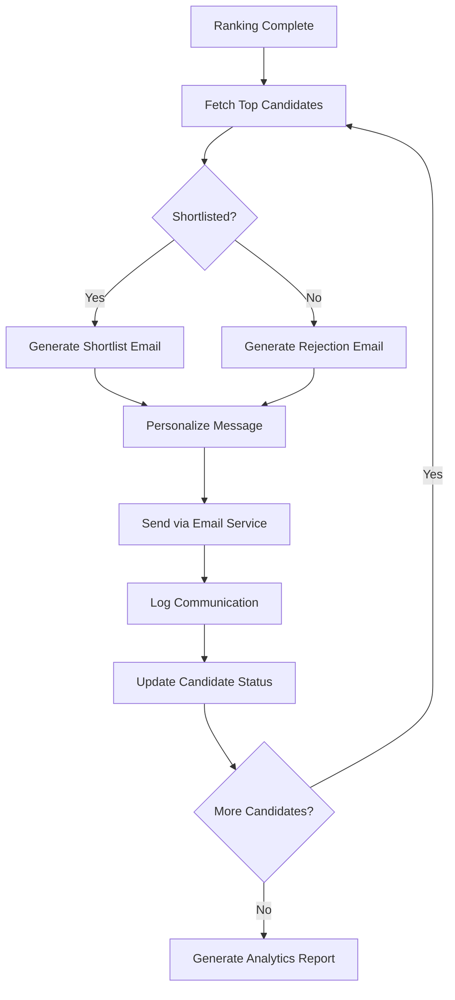

# Communication Agent

Automated candidate engagement and notification system that handles shortlisting communications, interview scheduling, and multi-channel notifications using AI-generated personalized messages.

## Use Case

This agent automates the communication workflow after candidate ranking. It generates personalized emails and notifications for shortlisted candidates, handles rejection communications professionally, schedules interview invitations, and maintains communication logs for compliance and tracking.

## Features

- ✉️ Automated personalized email generation
- 📱 Multi-channel notifications (Email, SMS, WhatsApp)
- 🤖 AI-powered message customization
- 📅 Interview scheduling integration
- 📋 Shortlist and rejection communication
- 🔔 Status update notifications
- 📊 Communication tracking and analytics
- ✅ Template management with variable injection

## What This Agent Does

1. **Candidate Shortlist Processing**: Retrieves ranked candidates from `ranking_agent`
2. **Message Personalization**: Generates customized messages using:
   - Candidate name and role
   - Job-specific details
   - Company information
   - Match highlights
3. **Email Generation**: Creates professional HTML emails with:
   - Personalized greeting
   - Job opportunity details
   - Next steps and timeline
   - Interview scheduling links
4. **Notification Dispatch**: Sends via configured channels (SendGrid, Twilio, etc.)
5. **Rejection Handling**: Sends respectful rejection emails to non-shortlisted candidates
6. **Status Updates**: Keeps candidates informed at each stage
7. **Logging**: Records all communications in Firestore for audit trail

## Message Templates

### Shortlist Email

```
Subject: Exciting Opportunity at [Company] - [Role Title]

Dear [Candidate Name],

Congratulations! Your profile has been shortlisted for the [Role Title] position at [Company].

We were impressed by your experience in [Top Matched Skills] and believe you would be a great fit for our team.

Next Steps:
- Interview Date: [Proposed Dates]
- Interview Format: [Virtual/In-Person]
- Duration: [Duration]

Please confirm your availability by clicking the link below:
[Scheduling Link]

We look forward to speaking with you!

Best regards,
[Recruiter Name]
[Company Name]
```

### Rejection Email

```
Subject: Update on Your Application - [Role Title] at [Company]

Dear [Candidate Name],

Thank you for your interest in the [Role Title] position at [Company].

After careful consideration, we have decided to move forward with other candidates whose experience more closely aligns with our current requirements.

We were impressed by [Positive Highlight] and encourage you to apply for future opportunities that match your skills.

Your profile will be kept on file for [Duration].

Best wishes in your job search!

Best regards,
[Recruiter Name]
[Company Name]
```

## Output Schema

```json
{
  "communication_id": "COMM-2025-001",
  "job_id": "JD-2025-001",
  "timestamp": "2025-01-05T13:00:00Z",
  "emails_sent": [
    {
      "candidate_id": "CAND-2025-042",
      "email": "jane.smith@example.com",
      "type": "shortlist",
      "status": "sent",
      "message_id": "sg-msg-123456",
      "sent_at": "2025-01-05T13:05:00Z",
      "personalization": {
        "candidate_name": "Jane Smith",
        "role_title": "Senior Backend Engineer",
        "top_skills": ["Python", "FastAPI", "Kubernetes"],
        "interview_link": "https://calendly.com/hr/interview-slot"
      }
    }
  ],
  "total_shortlisted": 10,
  "total_rejected": 140,
  "delivery_stats": {
    "sent": 150,
    "delivered": 148,
    "bounced": 2,
    "opened": 95,
    "clicked": 42
  }
}
```

## Usage

### Local Development

```bash
cd communication_agent
adk web
```

### Programmatic Usage

```python
from communication_agent import root_agent
from google.adk.runners import Runner

runner = Runner(agent=root_agent)
result = await runner.run_async(user_content="Send shortlist emails for JD-2025-001")
```

## Environment Variables

Required in `.env` file:

```bash
GOOGLE_API_KEY=your-gemini-api-key
FIREBASE_PROJECT_ID=your-project-id
GOOGLE_APPLICATION_CREDENTIALS=path/to/service-account.json

# Email Service (SendGrid or SMTP)
SENDGRID_API_KEY=your-sendgrid-key
FROM_EMAIL=recruiter@yourcompany.com
FROM_NAME=YourCompany Recruitment

# Optional: SMS/WhatsApp
TWILIO_ACCOUNT_SID=your-twilio-sid
TWILIO_AUTH_TOKEN=your-twilio-token
TWILIO_PHONE_NUMBER=+1234567890
```

## Integration Points

- **Input**: 
  - Ranked candidate list from `ranking_agent`
  - Job details from `jd_parsing_agent`
  - Candidate contact info from `resume_parsing_agent`
- **Output**: 
  - Email delivery logs
  - Communication analytics
- **External Services**:
  - SendGrid for email delivery
  - Twilio for SMS/WhatsApp (optional)
  - Google Calendar API for scheduling (optional)

## Communication Workflow



## Features in Development

- [ ] AI-powered response parsing (from candidate replies)
- [ ] Automated follow-up reminders
- [ ] Multi-language support
- [ ] Interview feedback collection
- [ ] Calendar integration for auto-scheduling
- [ ] SMS and WhatsApp integration
- [ ] Email open and click tracking
- [ ] A/B testing for email templates

## Compliance & Privacy

- ✅ GDPR-compliant data handling
- ✅ Unsubscribe link in all emails
- ✅ Communication logs for audit trail
- ✅ Candidate data retention policies
- ✅ No sharing of candidate data without consent
